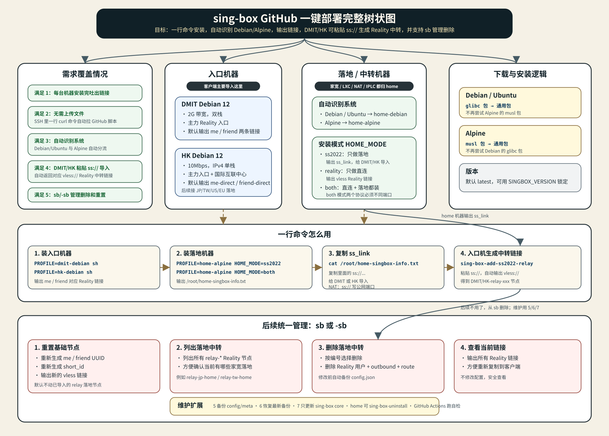

# Smart sing-box Installer



这是给你放在 GitHub 上用的 sing-box 智能一键安装器。核心目标很简单：所有机器都只记一条命令，然后按菜单选择安装类型。

## 日常操作索引

常用操作按这个找：

```text
新装 DMIT/HK/Home 机器        看：一条命令走天下
装完检查版本/配置/服务状态    看：装完自检
查看节点链接和密码            看：落地/中转机器 或 info 文件
把 home SS2022 导入 DMIT/HK  看：导入落地到 DMIT/HK
NAT/LXC 端口映射怎么改        看：NAT/LXC 端口映射
删除某个家宽 relay 节点       看：统一管理菜单，选 sb 第 3 项
备份/恢复/更新 core           看：统一管理菜单
卸载 DMIT/HK 入口机           看：入口机整机卸载
恢复 DMIT/HK 入口机           看：入口机整机卸载里的 restore
卸载 home 落地机器            看：Home 落地卸载
恢复 home 落地机器            看：Home 落地卸载里的 restore
```

## 一条命令走天下

所有机器都执行：

```sh
curl -fsSL https://raw.githubusercontent.com/xijicao/smart-singbox-installer/main/install.sh | sh
```

如果极简系统没有 `curl`，用备用命令：

```sh
wget -qO- https://raw.githubusercontent.com/xijicao/smart-singbox-installer/main/install.sh | sh
```

菜单固定四项：

```text
1) DMIT entry machine
2) HK entry machine
3) Home/landing machine - SS2022 only
4) Home/landing machine - Reality + SS2022
```

怎么选：

1. `DMIT` 2G 双栈主力入口机，选 `1`
2. `HK` 10M IPv4 小水管入口/中转机，选 `2`
3. 家宽、LXC、NAT、IPLC 只做 SS2022 落地，选 `3`
4. 家宽、LXC、NAT、IPLC 同时做 Reality 直连 + SS2022 落地，选 `4`

DMIT/HK 入口机默认会启用 nftables 防火墙。安装前先把 SSH 改到高位端口 `51398`，并确认你能用 `51398` 登录。脚本会检查 `51398` 正在监听，然后才写入防火墙规则。

入口机 nftables 规则使用 `table inet`，会同时作用于 IPv4 和 IPv6：

```text
允许 TCP 51398  # SSH
允许 TCP 443    # Reality
允许 ICMP / IPv6 ICMP
其它入站默认 drop
出站默认 accept
forward 默认 accept
```

Home 家宽/NAT/LXC 机器不会默认启用 nftables，避免和面板端口映射冲突。

选 `3` 或 `4` 时，脚本会自动识别 Debian/Ubuntu/Alpine。Debian/Ubuntu 优先下载 glibc 包，Alpine 优先下载 musl 包；对应包失败后只退到通用包，不乱试其它系统包。

选 `4` 安装 Reality + SS2022 时，会额外选择 Reality 握手/SNI 地区：

```text
1) JP - www.sony.jp
2) TW - www.cht.com.tw
3) HK - www.hkex.com.hk
4) US - reed.edu
5) EU - www.siemens.com
6) Custom domain
```

日本机器选 `1`，台湾机器选 `2`。如果你自己用 curl/openssl 测到了更合适的目标域名，选 `6` 输入纯域名即可。

## 最终架构

只分两类机器：

1. 入口机器：`DMIT`、`HK`
2. 落地/中转机器：家宽、LXC、NAT、IPLC

IPLC 不再单独特殊处理。它性能好或直连好就选菜单 `4`，只想做落地就选菜单 `3`。

## 入口机器

### DMIT

1. 2G 带宽，双栈，日常主力
2. 默认生成两个 Reality 节点：你和朋友
3. 以后可粘贴任意 `ss://` 落地链接，自动生成对应 Reality 中转节点

### HK

1. 10 Mbps 小水管，IPv4 单栈
2. 默认生成两个 Reality 节点：你和朋友
3. 作为国际互联中心，中转日本、台湾、美国、欧洲等落地
4. 每粘贴一个 `ss://`，自动生成一个新的 Reality 中转节点用于手动切换

DMIT/HK 安装后都会有：

```sh
sing-box-add-ss2022-relay
sb
-sb
sing-box-entry-uninstall
```

## 落地/中转机器

菜单 `3`：

```text
Home/landing machine - SS2022 only
```

只安装 SS2022，适合直连质量一般、只想给 DMIT/HK 当落地的家宽/NAT/LXC。

菜单 `4`：

```text
Home/landing machine - Reality + SS2022
```

同时安装直连 Reality 和 SS2022 落地，适合性能和直连质量都还行的机器。

Reality 目标域名按地区选择，默认候选是：

```text
JP: www.sony.jp
TW: www.cht.com.tw
HK: www.hkex.com.hk
US: reed.edu
EU: www.siemens.com
```

安装完会自动生成：

```text
/root/home-singbox-info.txt
```

如果启用了 SS2022，里面会给：

```text
ss_link:
ss://...

ss_link_editable:
ss://method:password@server:port#name
```

普通公网机器直接复制 `ss_link`。NAT/LXC 端口映射机器建议复制 `ss_link_editable`，把端口改成面板公网端口后再导入 DMIT/HK。

## 装完自检

Alpine 机器：

```sh
sing-box version
sing-box check -c /etc/sing-box/config.json
rc-service sing-box status
cat /root/home-singbox-info.txt
```

Debian/Ubuntu 机器：

```sh
sing-box version
sing-box check -c /etc/sing-box/config.json
systemctl status sing-box --no-pager
cat /root/dmit-singbox-info.txt 2>/dev/null || cat /root/hk-singbox-info.txt 2>/dev/null || cat /root/home-singbox-info.txt
```

DMIT/HK 入口机再检查 nftables：

```sh
nft list ruleset | grep -E '51398|443'
```

这些命令分别用于查看 sing-box 版本、检查配置、确认服务运行状态、查看节点链接和敏感信息文件。

## 导入落地到 DMIT/HK

在落地机器上：

```sh
cat /root/home-singbox-info.txt
```

复制 `ss_link` 或手动改好端口后的 `ss_link_editable`。

然后在 DMIT 或 HK 上运行：

```sh
sing-box-add-ss2022-relay
```

粘贴 `ss://` 链接即可。脚本会自动：

1. 解析 method/password/server/port/name
2. 备份 `/etc/sing-box/config.json`
3. 新增 SS2022 outbound
4. 新增 Reality UUID 和 short_id
5. 把这个 Reality 用户路由到该 SS2022 落地
6. `sing-box check` 通过后重启
7. 返回新的 `vless://` Reality 中转链接

## NAT/LXC 端口映射

这里分清两个端口就行：

1. home 机器里的监听端口是 sing-box 实际监听的端口。
2. 面板公网映射端口是 DMIT/HK 真正要连接的端口。
3. 比如面板是 `24496 -> 443`，home 机器里监听 `443`，但喂给 DMIT/HK 的 `ss://` 端口要写 `24496`。

安装后如果看到：

```text
ss_link_editable:
ss://method:password@server:443#jp-home-SS2022
```

你直接改成：

```text
ss://method:password@server:24496#jp-home-SS2022
```

再粘贴到 DMIT/HK 的 `sing-box-add-ss2022-relay` 即可。机器实际监听端口不需要跟着改。

如果同一台机器选菜单 `4`，SS2022 和 Reality 必须使用不同端口。推荐这样分开：

```text
公网 TCP 24496 -> 容器 TCP 443   # SS2022 落地
公网 TCP 24497 -> 容器 TCP 8443  # Reality 直连
```

## 统一管理菜单

DMIT/HK 安装后可以运行：

```sh
sb
```

或者：

```sh
-sb
```

菜单功能：

1. 重新生成你和朋友的基础 Reality UUID / short_id，并输出新链接
2. 列出所有 `relay-*` 家宽落地中转节点
3. 删除指定 `relay-*` 家宽落地中转节点
4. 查看所有当前 Reality 链接
5. 立刻备份当前 config/meta/core 到 `/etc/sing-box/backups`
6. 恢复最新一份 config/meta 备份，并检查配置后重启
7. 只更新 sing-box core，不改配置，失败会恢复旧 core

删除家宽落地时，选择第 `3` 项即可。脚本会自动删除对应 Reality 用户、SS2022 outbound 和 route 规则，并在修改前备份配置。

注意：`sb` 的第 `3` 项只是删除某个 `relay-*` 家宽落地中转节点，不会卸载 DMIT/HK 入口机本身。

## 入口机整机卸载

DMIT/HK 入口机安装后会有：

```sh
sing-box-entry-uninstall
```

执行前需要输入 `UNINSTALL_ENTRY` 确认，并会先打包备份到：

```text
/root/sing-box-entry-uninstall-backup-*.tar.gz
```

它会删除这套入口机 sing-box 服务、`/etc/sing-box`、`/root/dmit-singbox-info.txt`、`/root/hk-singbox-info.txt`、`sing-box-add-ss2022-relay`、`sb`、`-sb` 和 `/usr/local/bin/sing-box`。

它不会卸载 apt 依赖包，也不是把系统恢复到刚买机器的初始状态。

恢复最近一次入口机卸载备份：

```sh
sing-box-entry-restore
```

指定某个备份恢复：

```sh
sing-box-entry-restore /root/sing-box-entry-uninstall-backup-YYYYMMDDHHMMSS.tar.gz
```

恢复前会先生成一份当前状态备份到 `/root/sing-box-entry-pre-restore-backup-*.tar.gz`，然后解压备份、检查配置并重启 sing-box。

## Home 落地卸载

home 落地机器安装后会有：

```sh
sing-box-uninstall
```

执行前需要输入 `UNINSTALL` 确认，并会先打包备份到 `/root/sing-box-uninstall-backup-*.tar.gz`。

它会删除 home 落地机器上的 sing-box 服务、配置、healthcheck、info 文件和 `/usr/local/bin/sing-box`。它同样不会卸载系统依赖包，也不是完整恢复系统初始状态。

恢复最近一次 home 卸载备份：

```sh
sing-box-restore
```

指定某个备份恢复：

```sh
sing-box-restore /root/sing-box-uninstall-backup-YYYYMMDDHHMMSS.tar.gz
```

恢复前会先生成一份当前状态备份到 `/root/sing-box-pre-restore-backup-*.tar.gz`，然后解压备份、检查配置并重启 sing-box。

## 安全

敏感信息默认保存在：

```text
/root/*singbox-info.txt
/etc/sing-box/reality-meta.env
```

## DMIT/HK 朋友直连用户管理

DMIT/HK 入口机的 `sb` 菜单现在支持直接添加和删除朋友 Reality 用户。

交互菜单：

```sh
sb
```

然后选择：

```text
8) Add a direct friend Reality user
9) Delete a direct friend Reality user
```

也可以直接运行：

```sh
sb add-friend alice
sb delete-friend alice
```

推荐朋友命名可以用简单编号：

```text
me
fr1
fr2
fr3
fr4
```

例如新增 `fr4`：

```sh
sb add-friend fr4
```

删除 `fr2`：

```sh
sb delete-friend fr2
```

如果用菜单删除，`sb` 会列出现有普通直连 Reality 用户，例如：

```text
1) me
2) fr1
3) fr2
4) fr3
```

输入编号即可删除对应用户。

添加朋友会自动生成新的 UUID 和 short_id，写入 `/etc/sing-box/config.json`，检查配置并重启 sing-box，然后输出新的 `vless://` 导入链接。

删除朋友只会删除普通直连 Reality 用户，不会删除 `relay-` 开头的家宽 relay 节点。删除前会生成配置备份：

```text
/etc/sing-box/config.json.bak.add-friend.YYYYMMDDHHMMSS
/etc/sing-box/config.json.bak.delete-friend.YYYYMMDDHHMMSS
```

权限默认 `600`，只有 root 能读写。不要上传到 GitHub。

## GitHub 自检

仓库里带了：

```text
tools/self-check.sh
.github/workflows/self-check.yml
```

上传到 GitHub 后，每次 push 会自动检查 active 脚本是否能 `sh -n` 通过、关键文件是否存在、旧的危险 Reality 全量轮换文案是否残留、假 IP/假密钥是否漏进 active 文件。
