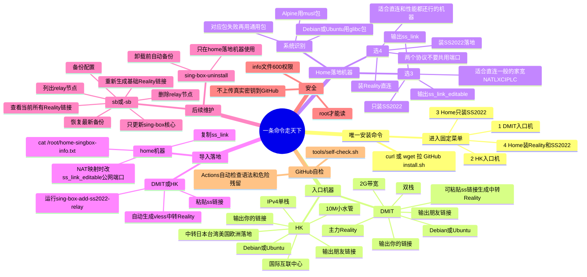

# 树状图图片


# 架构思维导图

## Mermaid 版



## 文字版

### 1. 所有机器都只跑一条安装命令

```sh
curl -fsSL https://raw.githubusercontent.com/xijicao/smart-singbox-installer/main/install.sh | sh
```

如果没有 `curl`：

```sh
wget -qO- https://raw.githubusercontent.com/xijicao/smart-singbox-installer/main/install.sh | sh
```

然后按菜单选：

```text
1) DMIT entry machine
2) HK entry machine
3) Home/landing machine - SS2022 only
4) Home/landing machine - Reality + SS2022
```

### 2. DMIT 和 HK 是入口

`DMIT` 和 `HK` 不是落地机器，它们是你和朋友平时导入客户端的入口。

默认安装后都会输出两个 Reality 链接：

1. 你用的链接
2. 朋友用的链接

同时都会安装两个管理工具：

```sh
sing-box-add-ss2022-relay
sb
-sb
```

### 3. 家宽 / LXC / NAT / IPLC 都是 home 机器

不再给 IPLC 单独搞特殊脚本。

只想做落地，菜单选：

```text
3
```

性能好或直连好，菜单选：

```text
4
```

### 4. NAT/LXC 端口映射

如果是 NAT/LXC 端口映射，比如公网 `24496 -> 443`，home 机器实际监听还是 `443`。

安装后查看：

```sh
cat /root/home-singbox-info.txt
```

找到：

```text
ss_link_editable:
ss://method:password@server:443#jp-home-SS2022
```

把里面的 `:443` 改成 `:24496`，再粘到 HK/DMIT 的 `sing-box-add-ss2022-relay`。机器实际监听端口不用改。

如果菜单选 `4`，SS2022 和 Reality 不要共用同一个公网端口。推荐：

```text
24496 -> 443   # SS2022
24497 -> 8443  # Reality
```

### 5. 添加落地的流程

先在 home 机器安装，查看：

```sh
cat /root/home-singbox-info.txt
```

复制里面的：

```text
ss_link:
ss://...
```

再到 DMIT 或 HK 运行：

```sh
sing-box-add-ss2022-relay
```

粘贴 `ss://`，它会自动生成新的 Reality 中转链接。

### 6. 删除落地的流程

到 DMIT 或 HK 运行：

```sh
sb
```

选择：

```text
3) Delete a relay Reality node
```

然后按编号删除对应 `relay-*` 节点。

### 7. 查看和维护

到 DMIT 或 HK 运行：

```sh
sb
```

常用选项：

```text
1) Regenerate base Reality links for me/friend
4) Show all current Reality links
5) Backup config/meta now
6) Restore latest config/meta backup
7) Update sing-box core only
```

第 `7` 项只更新 sing-box 二进制，不改配置。更新前会自动备份，检查失败会恢复旧 core。

### 8. home 落地卸载

只在 home 落地机器上运行：

```sh
sing-box-uninstall
```

它会要求输入 `UNINSTALL`，并先打包备份。

### 9. GitHub 自检

上传仓库后会自动跑：

```sh
sh tools/self-check.sh
```

用来检查脚本语法、文件结构、旧危险文案残留和假值泄露。
